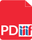

[](https://pdiiif.jbaiter.de)

[**Demo**](https://pdiiif.jbaiter.de)

[**Sample PDF generated with the library**](https://pdiiif.jbaiter.de/wunder.pdf)

[**Library API Documentation**](https://jbaiter.github.io/pdiiif)

**pdiiif** is a JavaScript library to **create PDFs from IIIF Manifests.**
For the most part, it runs both in browsers (that implement the
[File System Access API](https://caniuse.com/native-filesystem-api),
currently Chrome/Chromium Desktop and Edge only) and as a Node.js server-side
application. When generating a PDF in the browser, almost all communication happens
directly between the user's browser and the IIIF APIs referenced from the Manifest.
The only exception is for generating the cover page, which by default needs to be
generated on the server.

It comes with a small **sample web application** that demonstrates
how to use the library in the browser, you can check out a public instance
of it on https://pdiiif.jbaiter.de, the source code is contained in the
[`pdiiif-web` subdirectory](https://github.com/jbaiter/pdiiif/tree/main/pdiiif-web).

A main goal of the **library** is to be as _memory-efficient_ as possible, by
never holding more than a few pages in memory and streaming directly to
the user's disk (via chunked-encoding in the HTTP response on the server,
and by making use of the new Native Filesystem API in browsers).

It is also well-suited for embedding in other applications due to
its relatively small footprint, the example web application comes in at
**~116KiB gzipped** with all dependencies (if you use `manifesto.js` from
the IIIF commons in your application already, the total footprint will be
~30% smaller).

In addition to the images on the IIIF Canvases referenced in the manifest,
the library can create a **hidden text layer** from OCR associated with
each canvas (ALTO or hOCR referenced from a canvas' `seeAlso` property).

**Features**

- [x] PDF Page for every single-image Canvas in a Manifest
- [x] PDF Table of Contents from IIIF Ranges
- [x] Cover page with metadata, attribution and licensing information
- [x] Hidden text layer from ALTO or hOCR OCR
- [ ] Optional rendering of IIIF Annotations as PDF annotations _(planned for v0.2, Q2 2022)_
- [ ] Extraction of PDF annotations as IIIF anotations from PDFs generated with pdiiif _(planned for v0.2, Q2 2022)_
- [ ] Rendering Canvases with multiple images _(planned for 2022)_

**Quickstart**

Besides using the public instance at https://pdiiif.jbaiter.de, you can also run the app yourself.
The easiest way to do this is with Docker:

```
$ docker build . -t pdiiif
# SYS_ADMIN capabilities are required (for Puppeteer's headless Chrome instance to generate cover page PDFs)
$ docker run -p 8080:8080 --cap-add=SYS_ADMIN --name pdiiif
```

**Structure of the repository**

- [`./pdiiif-lib`](https://github.com/jbaiter/pdiiif/tree/main/pdiiif-lib): Contains the library source code
- [`./pdiiif-api`](https://github.com/jbaiter/pdiiif/tree/main/pdiiif-api): Small node.js server application that
  is responsible for generating the cover pages and that can be used as a fallback for browsers that don't support
  the Native Filesystem API
- [`./pdiiif-web`](https://github.com/jbaiter/pdiiif/tree/main/pdiiif-web): Sample web application (using Svelte)
  to demonstrate using pdiiif in the browser
